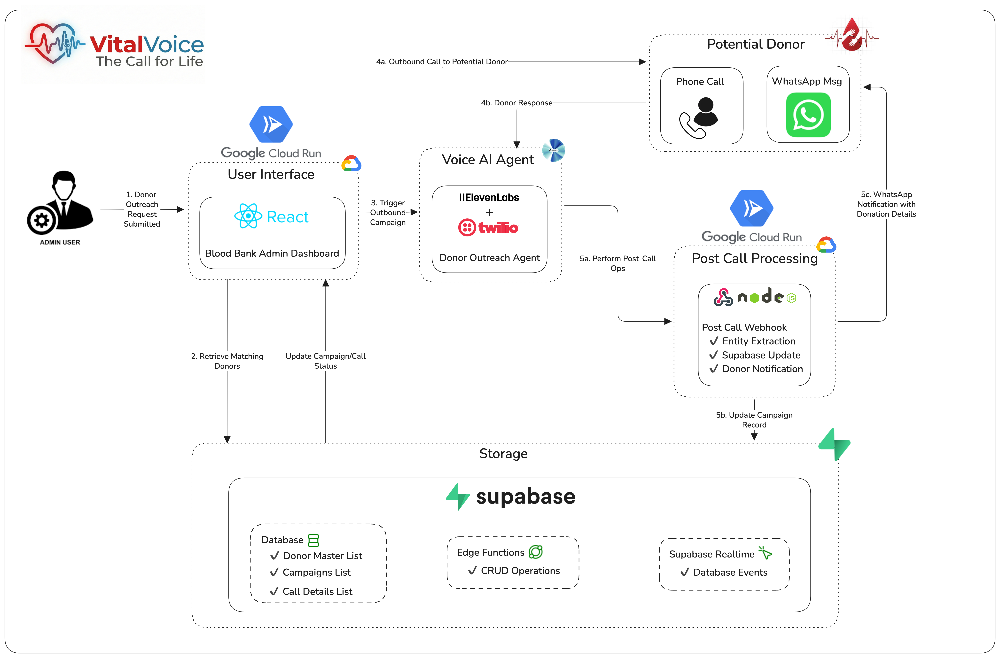
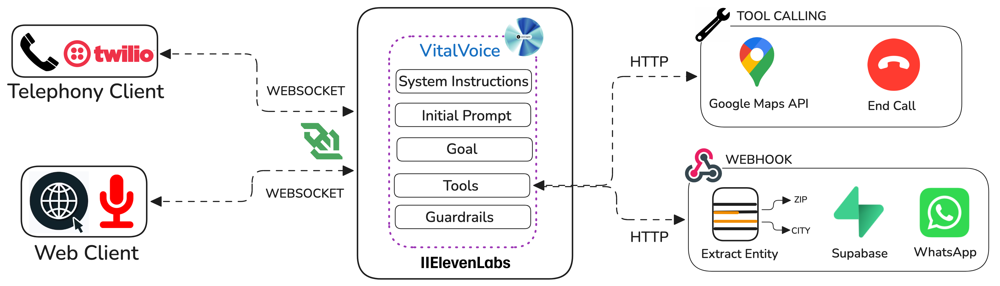

# VitalVoice Campaign Manager - Post Call Processing and Notification System


## Overview
This is a small Node.js/Express service that automates donor communication for blood donation campaigns. It integrates with Twilio (WhatsApp) to send messages and with Google Maps Distance Matrix API to compute travel distance and time. The server exposes endpoints for processing incoming donor data, calculating distances, and sending test WhatsApp messages.

## Features
- Send WhatsApp appointment details to donors via Twilio
- Calculate driving distance and ETA using Google Maps
- Process incoming webhook payloads to record call/transaction data
- Independent endpoint for manual WhatsApp testing

## Architecture


## Elevenlabs Voice Agent Architecture


## HTTP Endpoints

- **POST** `/process-info`
	- Accepts a `data` object (webhook payload). Reads donor fields from `data.analysis.data_collection_results` and, if the donor is available and eligible, sends a WhatsApp message using Twilio.
	- Typical body shape: `{ data: { analysis: { data_collection_results: { donor_availability, donor_eligibility, donor_name, hospital_location, blood_requirement_datetime, google_maps_link, ... } }, conversation_id, conversation_initiation_client_data } }`
	- Response: `200 OK` on success, `500` on error.

- **POST** `/get-distance`
	- Calculate driving distance & time between two addresses using Google Maps Distance Matrix API.
	- Request JSON: `{ "start": "Origin address", "destination": "Destination address" }`
	- Response JSON: `{ "distance_km": "<text>", "time_required": "<text>", "google_maps_link": "<url>" }`

- **POST** `/send/whatsapp`
	- Independent testing endpoint to send a static WhatsApp message via Twilio.
	- Request JSON: `{ "to": "<phone>", "text": "<optional text>" }`
	- Response JSON: `{ success: true, sid: "<twilio-sid>", message: "..." }`

## Environment Variables
Create a `.env` file (copy from `env.example`) and provide the following:

- `PORT` — server port (default: `3001`)
- `TWILIO_ACCOUNT_SID` — Twilio Account SID
- `TWILIO_AUTH_TOKEN` — Twilio Auth Token
- `TWILIO_WHATSAPP_NUMBER` — Twilio WhatsApp sender number (e.g. `whatsapp:+1415...`)
- `ELEVENLABS_API_KEY` — ElevenLabs API key (required by the app)
- `ELEVENLABS_AGENT_ID` — ElevenLabs agent id (required by the app)
- `GOOGLE_MAPS_API_KEY` — Google Maps API key (for distance calculations)

The service will exit on startup if required Twilio or ElevenLabs config is missing.

## Setup & Run

1. Install dependencies:

```sh
npm install
```

2. Copy and fill in `.env`:

```sh
cp env.example .env
# edit .env and add API keys and Twilio creds
```

3. Start the server:

```sh
npm start
```

By default the server listens on `PORT` (default `3001`).

## Usage Notes
- The `/process-info` endpoint expects a nested `data` payload; ensure incoming webhooks match the expected structure.
- The Twilio WhatsApp phone numbers must be in the format `whatsapp:+<countrycode><number>`.
- The `/send/whatsapp` endpoint in the code contains placeholder Twilio numbers—replace them with your configured `TWILIO_WHATSAPP_NUMBER` or call the endpoint with your `to` number.

## Dependencies
- `express`
- `body-parser`
- `twilio`
- `dotenv`
- `ws`

## Troubleshooting
- If messages are not sent, check Twilio credentials and that the WhatsApp sender is configured in your Twilio console.
- If distance calculation fails, verify `GOOGLE_MAPS_API_KEY` and that the address strings are valid.

## License
MIT

